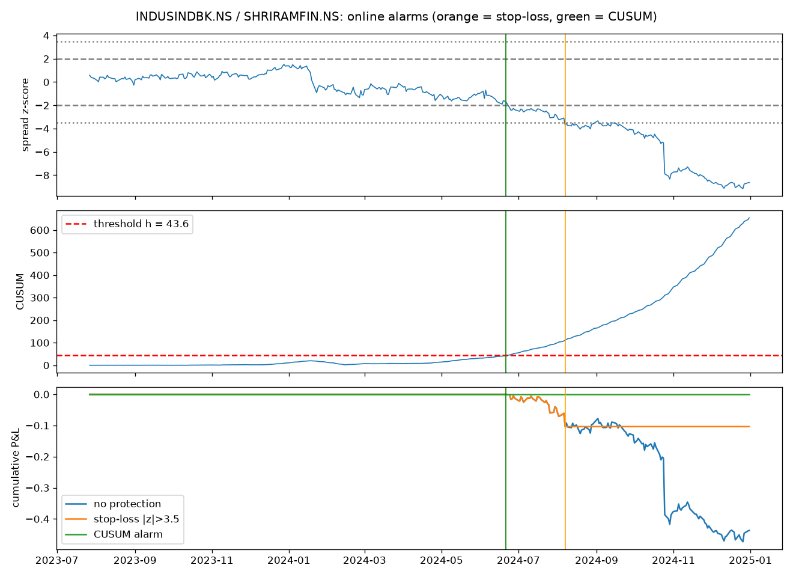

# Quant signal experiments

Small experiments that apply statistical signal-processing ideas to financial time series, with honest results, including the ones that don't work.

*An online CUSUM alarm (green line) fires just before a "cointegrated" pair breaks down. The unprotected strategy (blue) goes on to lose 0.44 in log returns, while the alarm keeps the strategy out of that trade.*

## Projects

### [When does a pair break?](pairs_breakdown/)
Pairs trading assumes two stocks keep moving together. Using NSE data from 2019–2024, including a pair from a published ESG pairs-trading paper, this project shows that:

- **Passing a cointegration test is not enough.** Both pairs tested cointegrated (p < 0.05) and still lost money afterwards.
- **An online CUSUM alarm reacts much faster than a stop-loss:** 56 vs 142 days on one pair, and 330 vs 377 days on the other.
- **Faster is not always better.** On one pair the alarm avoided the whole loss. On the other it also gave up about +0.5 of profit along the way, which the final P&L alone hides.

[Read the full write-up →](pairs_breakdown/)

## Related work
[eeg-correlation-regimes](https://github.com/manas-mk/eeg-correlation-regimes) uses the same rolling-correlation and change-point tools on EEG seizure data. It shows why random-matrix significance bounds fail on autocorrelated signals, the same trap that appears with financial returns.

---
Manas Manoj Kumar · B.E. Mathematics and Computing, BITS Pilani Dubai Campus
