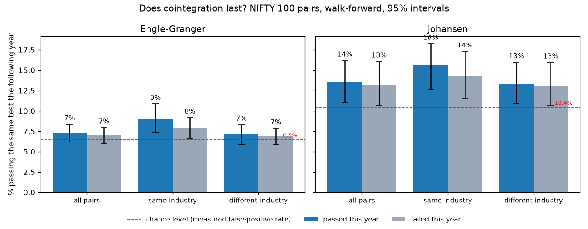

# Quant signal experiments

Small experiments that apply statistical signal-processing ideas to financial time series, with honest results, including the ones that don't work.

*Across about 168,000 walk-forward tests on NIFTY 100 pairs (2016–2026), passing a cointegration test this year barely changes the chance of passing next year, under either Engle–Granger or Johansen.*

## Projects

### 1. [When does a pair break?](pairs_breakdown/)
A close look at two NSE pairs, one taken from a published ESG pairs-trading paper, from 2019 to 2024.

- **Passing a cointegration test is not enough.** Both pairs tested cointegrated (p < 0.05) and still lost money afterwards.
- **An online CUSUM alarm reacted faster than a stop-loss**, and on one pair it avoided the whole loss.
- **Faster is not always better.** On the other pair it gave up about +0.5 of profit, which the final P&L alone hides.

### 2. [Does cointegration last? 20 stocks, 190 pairs](pairs_persistence/)
The follow-up that checks whether project 1 generalizes. It tests all 190 pairs every quarter using only past data, with block-bootstrap intervals.

- **Cointegration doesn't persist:** the next-year pass rate is 7.7% if the pair passes now and 7.6% if it doesn't.
- **A smaller p-value is not a better pair.**
- **The CUSUM alarm from project 1 does not generalize:** it fired in 87% of trades and hurt more often than it helped.

### 3. [Scaling up: NIFTY 100, Engle–Granger vs Johansen](pairs_nifty100/)
It covers 98 stocks and about 168,000 pair-windows, adds a second test, and measures each test's real false-positive rate.

- **The persistence result holds at 25× the scale:** Engle–Granger 7.3% vs 7.0%, Johansen 13.5% vs 13.2%.
- **Johansen's nominal 5% level is really about 10%** on one year of data. Without that check it would look twice as good at finding pairs.
- **Neither test picks profitable pairs,** and the small profit in the 20-stock study disappears on the wider universe.

## Related work
[eeg-correlation-regimes](https://github.com/manas-mk/eeg-correlation-regimes) uses the same rolling-correlation and change-point tools on EEG seizure data. It shows why random-matrix significance bounds fail on autocorrelated signals, the same trap that appears with financial returns.

---
Manas Manoj Kumar · B.E. Mathematics and Computing, BITS Pilani Dubai Campus
