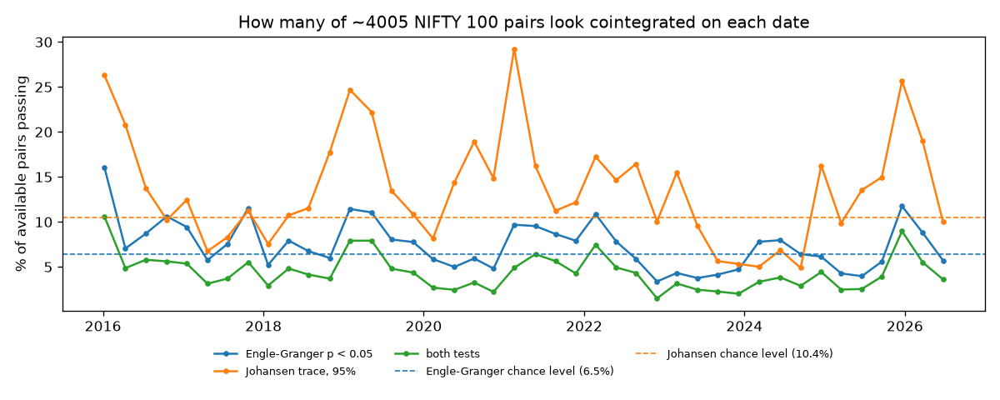
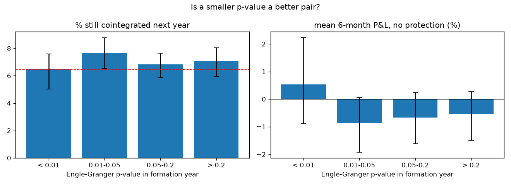
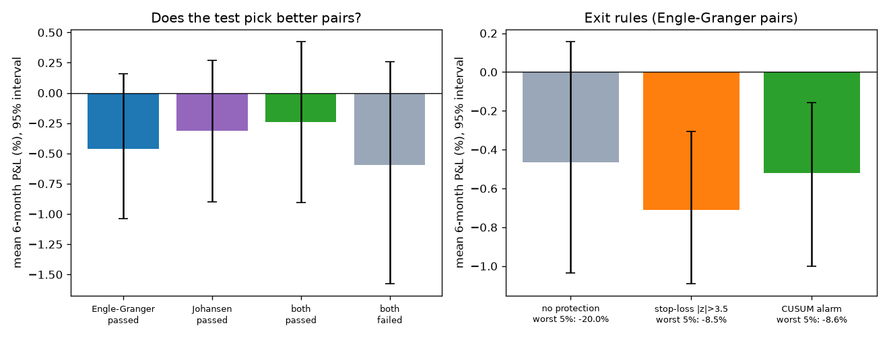

# Does cointegration last? NIFTY 100, Engle–Granger vs Johansen

This scales up my [20-stock study](../pairs_persistence/) to the whole **NIFTY 100**: 98 stocks, about 168,000 walk-forward pair-windows, 2016–2026. It also adds a second cointegration test (Johansen) and a check of how often each test is wrong on purely random data.


**Main finding:** passing a cointegration test this year barely changes the chance of passing next year. For Engle–Granger it is 7.3% against 7.0%, and for Johansen 13.5% against 13.2%, with fully overlapping intervals. The 20-stock result holds at 25 times the scale.

## Setup

- **Universe:** the current NIFTY 100 constituents with NSE industry labels (downloaded from NSE), and daily adjusted prices from Yahoo Finance for Jan 2015 – Aug 2026. Stocks that listed later (e.g. DMart, HAL, Eternal/Zomato, Jio Financial, Hyundai India) are used only in windows where they have complete prices; 4 very recent listings never have a full window.
- **Data breaks:** Yahoo does not adjust some demergers, such as Vedanta (Apr 2026, −65% in one day) and Tata Motors (Oct 2025, −40%). Any one-day move over 40% is treated as a data break, and that stock is left out of every window that contains it. This affected 4 stocks. Real crashes such as COVID and the Adani/Hindenburg sell-off are kept.
- **Walk-forward:** every quarter (42 formation dates) and for every available pair:
  1. **Formation (past 252 days):**
     - Engle–Granger test (A regressed on B, p < 0.05).
     - Johansen trace test (both stocks jointly, 95% level). It does not depend on which stock is called A.
     - Hedge ratio β.
  2. **Persistence:** the same tests on the next 252 days.
  3. **Trading (next 126 days):** z-score rule with β, mean and standard deviation frozen from formation. Enter at |z| > 2, exit at 0, 0.1% cost per trade. Three exit rules: no protection, stop-loss at |z| > 3.5, and the CUSUM alarm.
- **Chance levels (`00_size_check.py`):** each test was run on 2,000 pairs of *unrelated* random walks with the same length and volatility as the stocks.

  | test | nominal level | real false-positive rate |
  |---|---|---|
  | Engle–Granger | 5% | **6.5%** |
  | Johansen | 5% | **10.4%** |

  Johansen calls unrelated series "cointegrated" twice as often as advertised at this sample size. All charts use these measured rates as the chance line.
- **Intervals:** 95% moving-block bootstrap over formation dates, with blocks of 4 quarters.

## Results

### 1. Barely more pairs pass than chance



- **Engle–Granger** passes 7.3% of pairs, against a 6.5% chance level.
- **Johansen** passes 13.6%, against 10.4%.
- **Both tests together:** only 4.4% of pairs.

Passes come in waves across dates, which suggests market-wide co-movement rather than stable pair-specific links. Same-industry pairs are 8.9% of all pairs, 10.0% of Engle–Granger passes and 9.5% of Johansen passes.

### 2. Passing now doesn't predict passing next year

| next-year pass rate | passed this year | failed this year |
|---|---|---|
| Engle–Granger, all pairs | 7.3% [6.2, 8.3] | 7.0% [6.0, 7.9] |
| Engle–Granger, same industry | 9.0% [7.3, 10.8] | 7.9% [6.6, 9.2] |
| Johansen, all pairs | 13.5% [11.1, 16.2] | 13.2% [10.7, 16.1] |
| Johansen, same industry | 15.6% [12.6, 18.2] | 14.3% [11.6, 17.3] |

Same-industry pairs show a slightly higher pass rate under both tests. That is the only hint of structure, and the intervals still overlap.

### 3. A smaller p-value is not a better pair



Pairs with p < 0.01 persist 6.5% of the time, and pairs with p > 0.2 persist 7.1% of the time.

### 4. Neither test picks profitable pairs



| selected by | mean 6-month P&L | losing |
|---|---|---|
| Engle–Granger | −0.46% [−1.04, +0.16] | 46% |
| Johansen | −0.31% [−0.90, +0.27] | 42% |
| both tests | −0.24% [−0.91, +0.43] | 46% |
| neither test | −0.59% [−1.58, +0.26] | 41% |

No selection is significantly better than pairs that failed both tests. For example, passing both minus failing both is +0.35% [−0.26, +1.19]. The small profit in the 20-stock study (+1.9%) did not survive the wider universe.

### 5. Exit rules: protection costs the mean

| exit rule (Engle–Granger pairs) | mean | losing | worst 5% below |
|---|---|---|---|
| no protection | −0.46% | 46% | −20.0% |
| stop-loss \|z\| > 3.5 | −0.71% | 60% | −8.5% |
| CUSUM alarm | −0.52% | 56% | −8.6% |

- Both rules cut the worst 5% of outcomes from −20% to about −8.5%.
- Both lower the average.
- The CUSUM alarm fired in 91% of trades and helped 48% of the time, because its threshold is calibrated on data the spread was fitted to. This matches the 20-stock study.

## What I take from this

1. **One year of cointegration is close to noise for Indian large caps.** Neither test's verdict carries over to the next year, and a stronger p-value doesn't help.
2. **Check a test's real false-positive rate before trusting it.** Johansen's nominal 5% is really about 10% at this sample size. Without the size check, Johansen would look like it finds twice as many real relationships.
3. **A result on 20 stocks can flip on 100.** The small profit in the smaller study disappeared.

## Limitations

- **Survivorship bias:** these are *today's* NIFTY 100 members. Firms that dropped out of the index or were delisted are missing, which probably flatters every strategy here.
- **Data breaks:** the rule (one-day move > 40%) is a simple filter. A smaller unadjusted corporate action would slip through.
- **One year of formation, fixed thresholds** (2, 0, 3.5, k = 0.5), untuned on purpose. Longer formation windows or regime filters might change the persistence numbers.
- **Costs:** a flat 0.1% per trade, with no slippage or short-borrow cost.

## Next steps

- Two-year formation windows: does more data make cointegration last?
- Calibrate the CUSUM threshold on held-out data or a target false-alarm rate.
- Condition on market regime (calm vs stressed years).

## Run it

```bash
pip install -r ../requirements.txt
python 00_size_check.py    # real false-positive rates of both tests (about 15 s)
python 01_download.py      # NIFTY 100 list from NSE and prices from Yahoo
python 02_walkforward.py   # about 168k pair-windows, uses all CPU cores (10-30 min)
python 03_analyse.py       # the 4 charts and results/summary.txt
```
