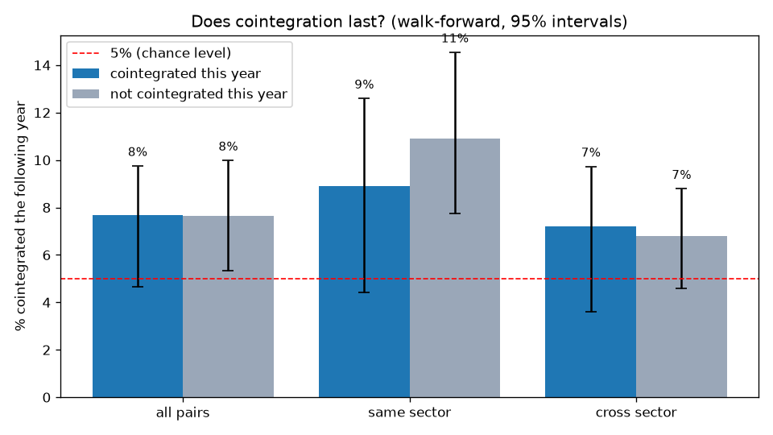
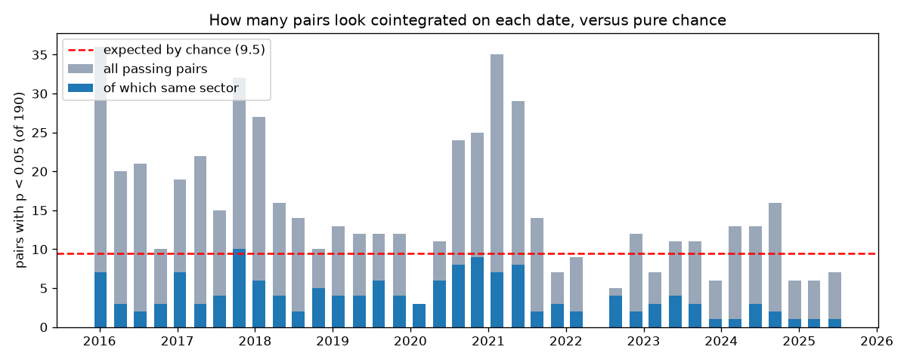
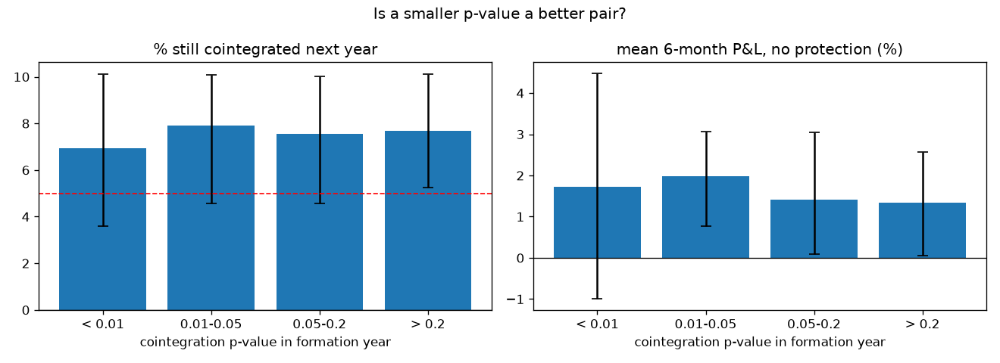
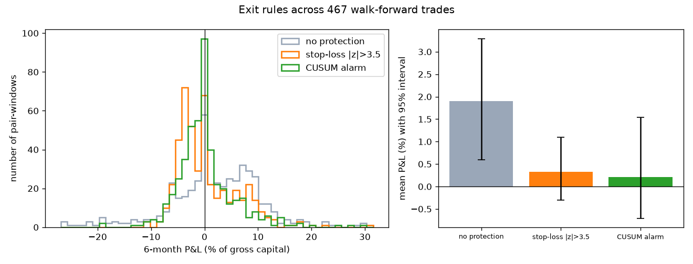

# Does cointegration last? A walk-forward test on 190 NSE pairs

My [first pairs project](../pairs_breakdown/) tested two pairs, with formation windows picked in hindsight. This one asks the same questions of every pair among 20 large NSE stocks, using **only past data at every step**.



**Main finding:** a pair that is cointegrated this year is **no more likely** to be cointegrated next year than a pair that isn't (7.7% vs 7.6%). On these stocks, the Engle–Granger test says almost nothing about the future.

## Setup

- **Stocks:** 20 large NSE stocks, 5 each from banks, IT, FMCG and metals. That gives 190 pairs: 40 in the same sector and 150 across sectors. Daily prices run from 2015 to 2025 (Yahoo Finance, adjusted for splits and dividends).
- **Walk-forward:** every quarter (38 dates, 2016–2025), and for every pair:
  1. **Formation:** run the Engle–Granger test on the *past* 250 trading days and fit the hedge ratio β.
  2. **Persistence:** run the same test on the *next* 250 days.
  3. **Trading:** trade the next 125 days with β, mean and standard deviation **frozen** from formation. Enter at |z| > 2, exit at z = 0, and pay 0.1% of gross position per trade. Three exit rules are compared: no protection, a stop-loss at |z| > 3.5, and the CUSUM alarm from the first project (calibrated on the formation year only).
- **Confidence intervals:** 95% moving-block bootstrap over formation dates, with blocks of 4 quarters. Pairs on the same date share stocks and market moves, and neighbouring dates overlap in time, so treating the 7,220 rows as independent would make every interval far too narrow.

## Results

### 1. More pairs pass than chance alone predicts, but not by much



At p < 0.05, about 9.5 of 190 pairs should pass by luck alone. On average 14.8 pass. The count swings from 0 to 36 and comes in waves. The biggest wave is in formation years containing the COVID crash and recovery (2020–21), when most stocks moved together, which suggests many "cointegrated" pairs just reflect a shared market move. Same-sector pairs are only slightly over-represented: they make up 21% of all pairs and 26% of passing pairs.

### 2. Cointegration does not persist

| next-year cointegration rate | cointegrated this year | not cointegrated this year |
|---|---|---|
| all pairs | 7.7% [4.7, 9.7] | 7.6% [5.3, 10.0] |
| same sector | 8.9% [4.4, 12.6] | 10.9% [7.7, 14.5] |
| cross sector | 7.2% [3.6, 9.7] | 6.8% [4.6, 8.8] |

Passing the test this year does not raise the chance of passing next year, even within a sector. Both rates sit a little above 5%. That may partly mean the test rejects slightly too often on 250 autocorrelated observations, not that the pairs are really linked.

### 3. A smaller p-value is not a better pair



Pairs with p < 0.01 are no more persistent (6.9%) than pairs with p > 0.2 (7.7%), and they are no more profitable either.

### 4. Profit comes from mean reversion in general, not from the test

- Pairs that passed made **+1.9%** on average over 6 months [+0.6, +3.3], and 35% of them lost money.
- Pairs that **failed** the test made +1.3% with the same rule.
- The difference, +0.6% [−1.1, +2.4], is not distinguishable from zero.

Short-term mean reversion between large Indian stocks seems to pay a little in this period, whether or not the pair "is cointegrated".

### 5. Exit rules trade mean for tail risk, and my CUSUM alarm does not generalize



| exit rule (467 trades) | mean 6-month P&L | losing trades | worst 5% below |
|---|---|---|---|
| no protection | +1.9% [+0.6, +3.3] | 35% | −13.7% |
| stop-loss \|z\| > 3.5 | +0.3% [−0.3, +1.1] | 52% | −6.2% |
| CUSUM alarm | +0.2% [−0.7, +1.5] | 51% | −6.7% |

- Both protective rules **halve the tail loss** but **remove most of the average profit**.
- The CUSUM alarm fired in **87%** of trades, after a median of 42 days. When it fired, it helped 39% of the time and **hurt 60%** of the time.

The reason is that its threshold was calibrated on the formation year, when the spread had been *fitted* to the data. So it looks calmer in-sample than it ever will out of sample. My first project's clean win on INDUSINDBK/SHRIRAMFIN was one of the 39%. Two pairs were not enough to see this.

## What I take from this

1. On these stocks, a cointegration test on one year of data is **not a reliable way to select pairs**. Its result doesn't carry over to the next year, and a smaller p-value doesn't help.
2. **Calibrate alarms on data they weren't fitted to.** A threshold set in-sample makes the detector trigger-happy. A held-out window, or a threshold set for a target false-alarm rate (average run length), would be the fair version.
3. **Test on many cases before believing a result.** The first project's headline came from n = 2.

## Limitations

- **Survivorship bias:** the 20 stocks are large companies *today*. Pairs involving firms that shrank or were delisted are missing.
- **Engle–Granger regresses A on B only**, and the result depends on direction. Johansen's test would treat both stocks symmetrically.
- **Trading rule:** thresholds are fixed and were not tuned (2, 0, 3.5, CUSUM k = 0.5), which avoids overfitting but may not be ideal. Costs are a flat 0.1% per trade, with no slippage or borrowing costs for the short leg.
- **Approximate intervals:** the block bootstrap handles most of the dependence between rows, but not all of it.

## Next steps

- CUSUM thresholds calibrated on held-out data or set for a target false-alarm rate.
- Johansen test, and a larger universe (Nifty 100).
- Does persistence depend on the market regime, for example calm versus stressed years?

## Run it

```bash
pip install -r ../requirements.txt
python 01_download.py      # prices.csv and sectors.csv (about 30 s)
python 02_walkforward.py   # results/walkforward.csv (2-4 min)
python 03_analyse.py       # the 4 charts and results/summary.txt
```
